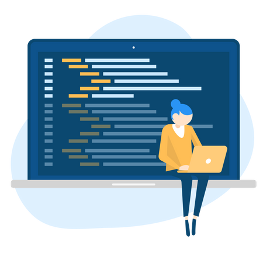

  

Throughout my software engineering course, I have learned about various fundamental concepts including open source software development, configuration management, functional programming, development environments, coding standards, ui frameworks, agile project management, design patterns, and ethics. Although these are significant for web application development, these concepts can also be generalized and applied to projects in different contexts. For example:

### Development Environments
Development environments concept covers using integrated development environments (IDE) and development tools to improve your development process. Rather than using a simple text editor, you might consider an IDE, as it acts as a code editor, compiler, debugger, and more. While Visual Studio Code (VS Code) is technically not an IDE, it can be customized with extensions to function as one. Just like when writing an essay, using a text editor such as Word or Google Docs makes your writing process much easier compared to writing it out by hand.

### Coding Standards
Coding standards are common practices that are thought to improve code quality. While they are not required to have code function properly, it is generally best to follow the standard as it helps make your code more readable and consistent. This further makes it easier to debug and to share with other developers. 

### Agile Project Management
Agile project management consists of laying out issues to address, estimating effort, dividing work in manageable chunks, and recording actual effort. This process of project management is applicable to any type of project, not just web development. 
