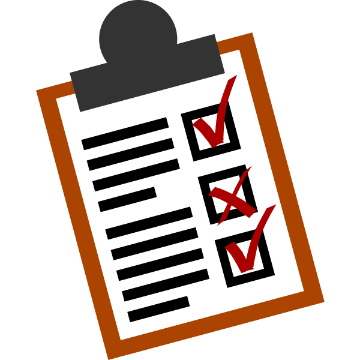

Coding standards are guidelines that aim to improve the quality of your code by making it readable and promoting good programming practices. This is comparable to writing, in the sense that punctuation, grammar, formatting, and the quality of your handwriting can affect a reader’s experience. Similar to how using punctuation and splitting up long paragraphs can make an essay easier to read, in programming, following proper indentation, spacing, and meaningful variable names provides structure and clarity. 

Since beginning computer courses in college, I’ve had the opportunity to see how different students write their code. Even in times when we are completing the same assignment, I have noticed that everyone implements their programs in different ways. From my experience, I have found that I had an easier time understanding others’ programs when they organized and formatted them in the typical way. As a lab assistant for an introductory computer science course, I have seen how some students new to programming write their code. I have seen firsthand code that does not follow basic coding standards like indentation. When I see code like that, it comes as no surprise that the student might be having trouble understanding what they’re writing. 

### ESLint
Over the past week, I have been using ESLint with VSCode, and I have found it to be useful in enforcing coding standards. Even without ESLint, I would consider myself pretty accustomed to following common coding practices. However, using ESLint helps to nitpick everything and make less room for errors. That said, there are some things that ESLint catches, such as trailing spaces and double quotes, that I feel are minor issues. I still don’t really see why having a space after a curly brace is such a big deal, but when it comes down to it, it does make the code more polished. Additionally, coming from a background in Java and C/C++, I’m used to using double quotes instead of single quotes for strings. For simple issues like this, I find using `--fix` to be helpful.

Although coding standards may seem trivial when considering the big picture of programming, they can improve the quality of your program. Like developing any good habit, learning to use coding standards early in your programming journey will make it second nature as you get more comfortable with coding.
