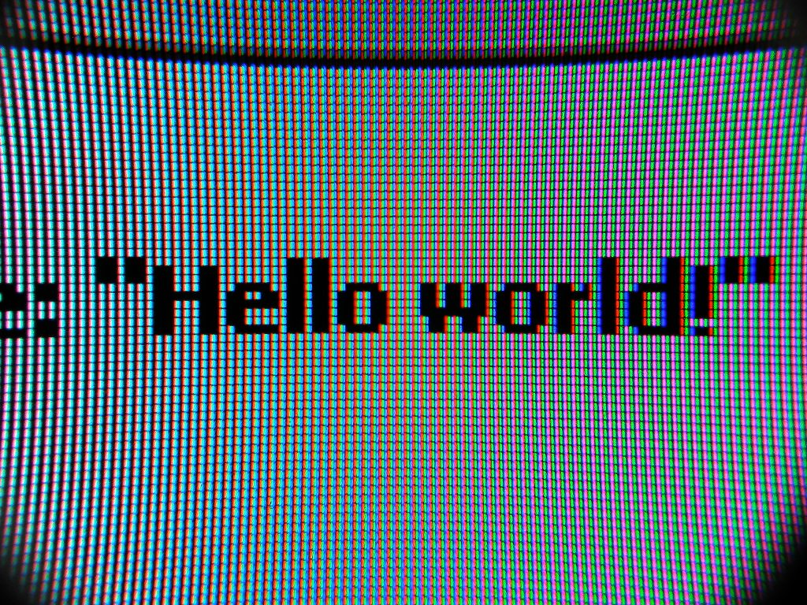

### Java… Script? No, TypeScript
I am once again learning a new language. When I first began programming, after the initial drag-and-drop block coding so many of us go through, the first language I learned was JavaScript. This was in a high school class that very briefly introduced programming through an online course containing tutorials and practice assignments. Looking back, this course barely touched the surface of JavaScript and was rather more of an introduction to basic coding. 

Although I started with JavaScript, out of all the programming languages I know, Java is the most familiar to me because I have been learning Java the longest. Furthermore, it was my first experience with object-oriented programming. Every time I learn a new language, I always compare it to Java. While I have used JavaScript, I had never heard about TypeScript before starting my software engineering class. Despite this, due to my background with Java and C/C++, I didn’t find it too difficult to pick up most of the JavaScript and TypeScript concepts. In my experience with TypeScript so far, remembering the syntax and understanding the ability to create objects without classes have been the challenge thus far. 

Progressing through the modules in my software engineering class, I have learned more about what TypeScript is capable of and how I can utilize it. While the initial tutorials on JavaScript felt more like a review to me, going over ES6's new aspects, such as using arrow functions and destructuring, was a challenge. These are definitely areas I need to practice more with since they are new concepts to me. From what I can see, TypeScript is a good programming language for software engineering. Compared to JavaScript, TypeScript is more readable and easier to understand due to its stricter syntax. Additionally, TypeScript has a type system that enables error checking at compile time. Overall, I've enjoyed my experience with TypeScript and am excited to continue utilizing it.

### Becoming an Athlete
Learning TypeScript has been a real workout as my software engineering class uses [Athletic Software Engineering](https://philipmjohnson.org/essays/ase-2017.html). It’s a different approach to learning than the traditional classroom, which keeps you on your toes by having you complete Workouts of the Day (WODs) every week. The week begins with practice WODs, then continues with a group WOD, and finally ends with an in-class WOD that tests what you've learned throughout the week. Having experienced this for a couple of weeks now, I have found that this system has helped keep me productive and motivated to continue learning and improving. 

Although the knowledge that there is essentially a timed test every single week stresses out the student in me, the practice WODs have helped prepare me for each in-class WOD. I have always been the type of person who likes to take their time on assignments, especially if it’s something complex; however, the timed WODs force me to think quickly and be as efficient as possible. This style of learning feels more productive because I’m spending less time “wasting time,” if that makes sense. My experience so far has been interesting because it almost feels like a game sometimes, trying to beat my personal best. As with all timed tasks, the anxiety is definitely still there, but I do find it enjoyable to an extent. While I would like to say I dislike Athletic Software Engineering, I do acknowledge that the entire function of workouts is to help you grow stronger, or in this case, become a more competent programmer. 