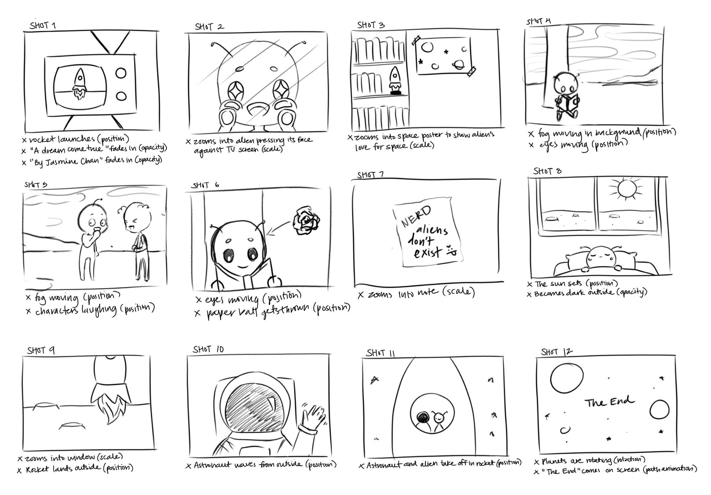

 

  <iframe src="https://drive.google.com/file/d/1p6rcbyyqHj5okYrmDk5hFURohRnbGtYJ/preview" align="center" width="854" height="480" allow="autoplay"></iframe>

 

A Dream Come True is a short animation playing on the idea of humans being the "aliens" to extraterrestrial life. 

The animation follows a young main character who enjoys everything about space and aliens. In his free-time, he often keeps up with outer space discoveries and reads books about alien life. Unfortuantely, this main character's peers don't seem to understand his facination with aliens, making fun of him for believing in such a ridiculous idea. 

Feeling down from all the bullying, the main character heads to bed one day, when suddenly, there is a commotion outside his window. It's an alien spaceship! A figure in a white suit comes out, inviting him aboard.

It's a dream come true! Aliens *are* real. 

### Storyboarding
The process of creating this animation started with brainstorming ideas about what to make. This was my original story concept:

*An alien watches a rocket launch on the television, excited because it loves space and rockets. That night, while the alien is asleep, a rocket lands outside its window. An astronaut comes and invites the alien aboard.*

Watching the animation, you might notice that the concept evolved into a more developed story following the storytelling model with an exposition, rising action, climax, falling action, and a resolution. 

After deciding on my concept, I searched online for reference images I wanted to base the style of my animation on and started planning each shot out. Then, I drew a storyboard to outline each scene in the animation. Finally, I took this to Adobe Illustrator to create assets that I could then use in Adobe After Effects. 

### Outcomes

This project really opened my eyes to the amount of time and effort it takes to animate something. Even just this simple, one-minute animation took me over a week to make. There are a lot of things happening behind the scenes that you don't see when watching an animation. With all the resources available, anyone can draw an image and make it move on their screen. However, it takes a lot of planning and careful consideration of shots to create an interesting story. 