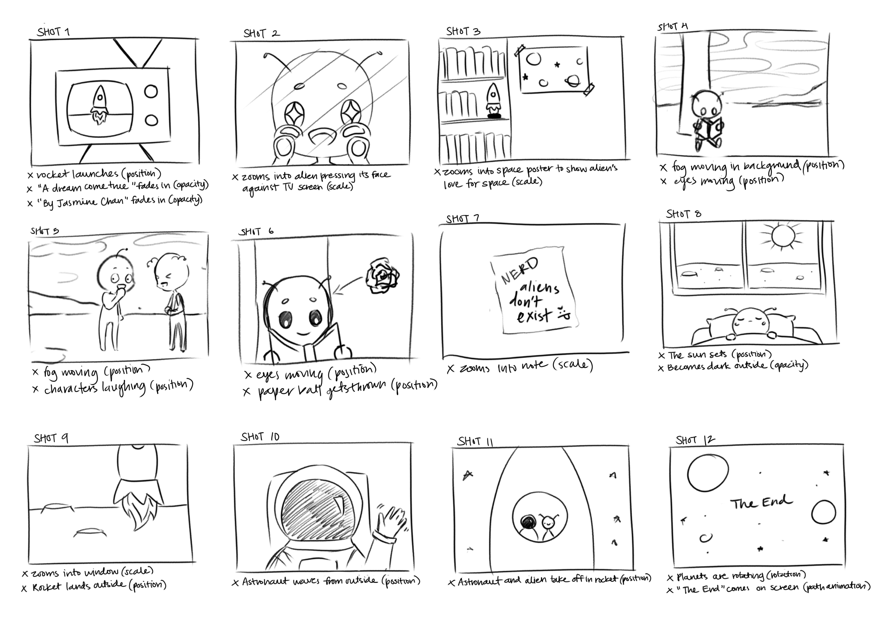

 

  <iframe src="https://drive.google.com/file/d/1p6rcbyyqHj5okYrmDk5hFURohRnbGtYJ/preview" align="center" width="854" height="480" allow="autoplay"></iframe>

 

A Dream Come True is a short animation playing on the idea of humans being the "aliens" to extraterrestrial life. 

The animation follows a young main character who enjoys everything about space and aliens. In his free-time, he often keeps up with outer space discoveries and reads books about alien life. Unfortuantely, this main character's peers don't seem to understand his facination with aliens, making fun of him for believing in such a ridiculous idea. 

Feeling down from all the bullying, the main character heads to bed one day, when suddenly, there is a commotion outside his window. It's an alien spaceship! A figure in a white suit comes out, inviting him aboard.

It's a dream come true. Aliens are real. 

 

 

## The Storyboard

