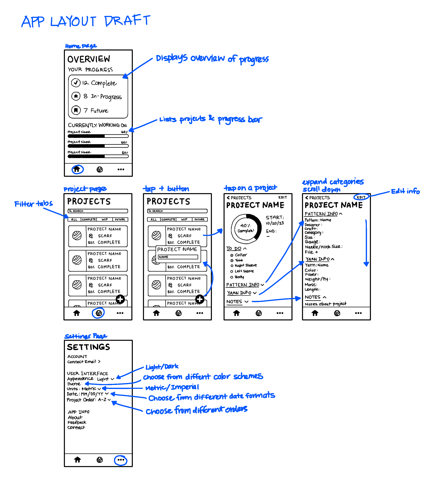
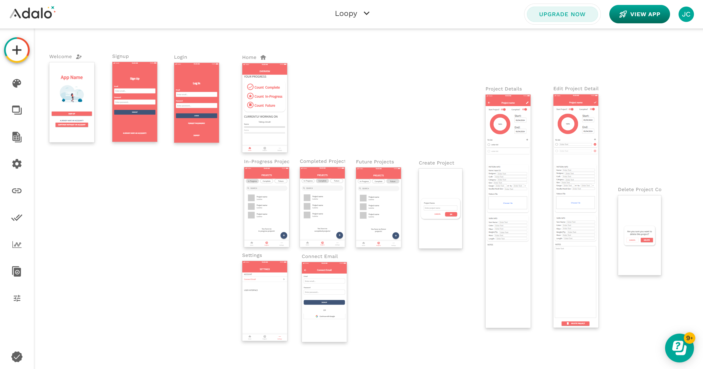

 
### Introduction

Knitting and crocheting are well-loved hobbies that many people of all ages and genders enjoy. However, creating projects can take a long time since these are handicraft hobbies. As a result, the novelty of a project often wears off before it’s finished, leading to a decrease in motivation to continue the project. For example, when knitting a pair of socks, one may finish one sock, then feel unmotivated to finish the second one. This is a common occurrence that has been dubbed “second sock syndrome.” Many people end up putting down the project and starting another one, thus finding themselves with a forgotten pile of works-in-progress. Like a long to-do list, this can cause a sense of anxiety.

There are a variety of websites and apps that aid in knitting and crocheting, with Ravelry being one of the most popular ones. Despite this, there is no official mobile app for Ravelry. In this project, I want to address the difficulty of maintaining motivation and keeping track of many projects. Looking at Raverly, a useful feature it has is a project tracker that allows a user to add projects and input information about them. With my mobile app, I aim to improve this type of project tracker by adding a motivational aspect through achievements. The goal of this project is to create a convenient application that helps maintain motivation throughout projects.

### Designing the App Layout

After the initial reasearch and planning for the project, I drew a simple layout of what I wanted to go into the app. 

### Building the App

At the time of this project, I had little experience in coding. Due to this, I decided to use Adalo, which is a no-code mobile app builder. 

### Side Note

Did you know that knitting and crocheting are very similar to coding? It seems unintuitive if you have never encountered a knitting or crochet pattern before, but once you see it, the similarities are clear. 

Here is a basic pattern for crocheting a sphere:

<pre>
R - row
sc - single crochet
inc - increase
dec - decrease

Start with a magic circle
R1: 6 sc [6]
R2: (inc)×6 [12]
R3: (sc, inc)×6 [18]
R4: sc, (inc, 2 sc)×5, sc [24]
R5: (3 sc, inc)×6 [30]
R6: 2 sc, (inc, 4 sc)×5, 2 sc [36]
R7-R13: 36 sc [36]
R14: 2 sc, (dec, 4 sc)×5, 2 sc [30]
R15: (3 sc, dec)×6 [24]
R16: sc, (dec, sc)×5, sc [18]
Fill sphere with stuffing
R17: (sc, dec)×6 [12]
R18: (dec)×6 [6]
Fasten off
</pre>

Do you see the pattern in this pattern? Looking closely, you might notice that the even numbered rows appear unnecessarily complicated. For instance, in R4, why not just write (2 sc, inc)×6 ? While it is up to preference and how you want your sphere to look, splitting the single crochets every other row will make the seam line of the sphere less visible. 

When I first started learning how to read a pattern, I immediately noticed the parallel to algorithms. The pattern above is just the beginning of what crochet patterns can entail. Creating more complex designs will result in a more complex pattern. 