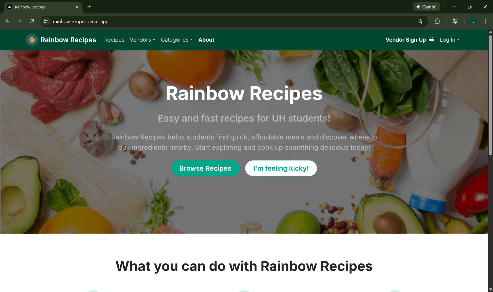
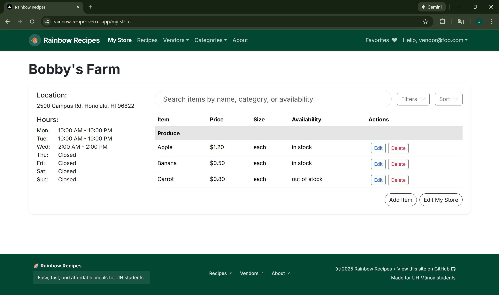
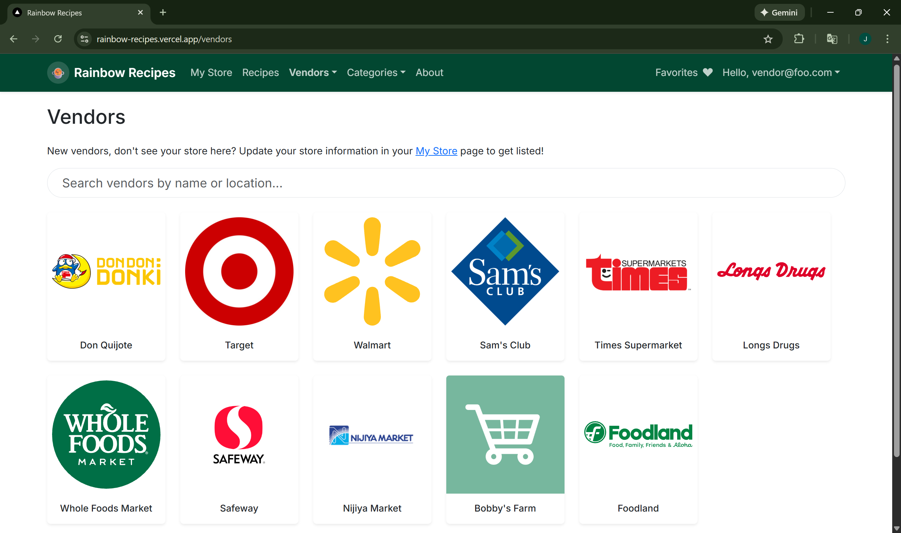

<div class="text-center my-3">
  
</div>

### Rainbow Recipes Overview

* **Deployed site:** [rainbow-recipes.vercel.app](https://rainbow-recipes.vercel.app/)
* **Project home page:** [rainbow-recipes.github.io](https://rainbow-recipes.github.io/)
* **Team members:** [Ievgen Borovenskyi](https://github.com/ievgen-maker), [Jasmine Chan](https://github.com/jasmineyschan), [Tylor Nadamoto Beller](https://github.com/tylornb), [Megan Wong ](https://github.com/mewong21)

###### **Problem**

*College students often have limited kitchen supplies and may lack basic cooking skills. With busy school schedules and part-time work, they have little time to not only learn and prepare meals, but to go out and buy groceries. As a result, it’s easy to fall into the habit of eating out or even forgetting to eat.*

###### **Solution**

*Rainbow Recipes aims to solve this issue, targeting students at UH Mānoa, by providing a system that students can use to learn or share quick, simple, and easy to prepare recipes:*
* *Uses minimal kitchen facilities and supplies.*
* *Ingredients are available within walking distance of UH.*
* *Suits local taste.*
* *Can be filtered via dietary restrictions (gluten-free, vegan, etc).*
* *Has an estimated cost per serving, estimated number of servings, and estimated prep-time.*

<hr class="my-3">

### My Contribution

To stay organized and efficient throughout this project, my team outlined various issues to address along with target completion dates. While we all worked together on application as a whole, much of my contribution was focused on implementing some of the vendor functionalities. This included adding a store and item models to the database and creating the My Store page and Vendors page. To see more of my contributions, view our [M1](https://github.com/orgs/rainbow-recipes/projects/1), [M2](https://github.com/orgs/rainbow-recipes/projects/6), and [M3](https://github.com/orgs/rainbow-recipes/projects/7) project pages. 

###### **Database Schema Excerpt**

```typescript
// prisma/schema.prisma
model Store {
  id       String         @id @default(cuid())
  name     String
  website  String?
  location String
  hours    String[]
  image    String?
  owner    String
  reviews  VendorReview[]
}

model StoreItem {
  id               Int          @id @default(autoincrement())
  databaseItemId   Int
  databaseItem     DatabaseItem @relation("StoreItemDatabaseItem", fields: [databaseItemId], references: [id])
  price            Decimal      @db.Decimal(10, 2)
  unit             String
  availability     Boolean
  owner            String
}

model DatabaseItem {
  id           Int          @id @default(autoincrement())
  name         String       @unique
  itemCategory ItemCategory @default(other)
  approved     Boolean      @default(false)
  recipes      Recipe[]     @relation("RecipeIngredients")
  storeItems   StoreItem[]  @relation("StoreItemDatabaseItem")
}
```

###### **My Store Page**

The My Store page is specific to users who have been approved as vendors. Here, a vendor can view their store, edit their store details, and add/edit their store items.

<div class="text-center">
  
</div>

###### **Vendors Page**

The Vendors page displays all the vendors who have established their store on the site. A user may click on a vendor's card to go to that vendor's individual store page.

<div class="text-center">
  
</div>

<hr class="my-3">

### Outcome

Although this project is techinically "finished", there are definitely many improvements and additional functions that could still be implemented. Despite this, I believe that my team and I were successful in developing a user-friendly application that caters towards the UH community. From this experience, I gained first-hand insight into the software engineering life cycle and challenges that a software engineer might encounter. While this was a lengthy and in-depth project, I had a lot of fun figuring out works and what doesn't. Additionally, with the time constraints of this class being a semester long course, starting off with a template was extremely helpful. During development, I didn't quite know exactly how to implement everything, but I had the basic idea. Having a starting point and building off of that aided my skill development and helped me learn along the way.